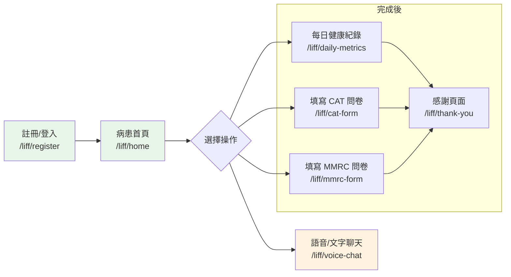

# 前端信息架構規範 - RespiraAlly

---

**文件版本 (Document Version):** `v1.0`  
**最後更新 (Last Updated):** `2025-11-03`  
**主要作者 (Lead Author):** `Gemini`  
**審核者 (Reviewers):** `[PM, UX Designer, Frontend Lead]`  
**狀態 (Status):** `草稿 (Draft)`  
**相關文檔:** `[PRD](./02_project_brief_and_prd.md)`, `[Frontend Architecture](./12_frontend_architecture_specification.md)`

---

## 1. 文檔目的與範圍

本文檔旨在為 `RespiraAlly` 的兩個前端應用（`Dashboard` 和 `LIFF`）提供完整的信息架構 (IA) 規範，作為前端開發、設計與測試的統一藍圖。

**核心目標：**
- ✅ 定義治療師端 (Dashboard) 和病患端 (LIFF) 的核心用戶旅程。
- ✅ 建立清晰的網站地圖 (Sitemap) 與頁面職責。
- ✅ 規範 URL 結構與路由設計。
- ✅ 提供關鍵頁面的實現規格與驗收標準。

---

## 2. 核心用戶旅程

本專案包含兩個獨立但互補的核心用戶旅程。

### 2.1 治療師用戶旅程 (Therapist Journey - Dashboard)
**目標**: 高效管理多位病患，快速掌握其健康狀況，並及時介入。

```mermaid
graph LR
    A[登入頁<br/>/login] --> B[儀表板總覽<br/>/dashboard/overview]
    B --> C{選擇一位病患}
    C --> D[病患詳情頁<br/>/dashboard/patients/{id}]
    D --> E[查看健康趨勢圖表]
    D --> F[查看問卷歷史紀錄]
    D --> G[管理個案/任務]
    B --> H[查看所有任務<br/>/dashboard/tasks]
    B --> I[衛教內容管理<br/>/dashboard/education]
    
    style A fill:#e3f2fd
    style B fill:#e3f2fd
    style D fill:#e3f2fd
```

### 2.2 病患用戶旅程 (Patient Journey - LIFF)
**目標**: 方便地記錄每日健康狀況，完成指定問卷，並透過 AI 助理獲得支持。



---

## 3. 網站地圖與導航結構 (Sitemap)

### 3.1 治療師儀表板 (Dashboard App)
```
/dashboard
│
├─ /overview (儀表板總覽頁)
│  └─ 主要入口，展示病患列表與關鍵指標。
│
├─ /patients/{patientId} (病患詳情頁)
│  ├─ #health-overview (錨點：健康總覽)
│  └─ #usage-overview (錨點：使用情況)
│
├─ /cases (個案管理頁)
│
├─ /tasks (任務管理頁)
│
├─ /education (衛教內容管理頁)
│
└─ /settings (設定頁)
```

### 3.2 病患 LIFF 應用 (LIFF App)
```
/liff
│
├─ /register (註冊頁)
│
├─ /home (病患首頁)
│  └─ 核心功能入口。
│
├─ /daily-metrics (每日健康紀錄表單)
│
├─ /cat-form (CAT 問卷表單)
│
├─ /mmrc-form (MMRC 問卷表單)
│
├─ /voice-chat (語音/文字聊天頁)
│
└─ /thank-you (提交完成後的感謝頁)
```

---

## 4. 頁面詳細規格 (Page Specifications)

### 4.1 儀表板總覽頁 (Dashboard - OverviewPage)

| 屬性 | 值 |
|:---|:---|
| **檔名** | `OverviewPage.jsx` |
| **URL** | `/dashboard/overview` |
| **頁面類型** | 儀表板 |
| **主要職責** | 提供所有被指派病患的宏觀視圖，快速識別需要關注的個案。 |
| **用戶目標** | 1. 查看病患列表。<br/>2. 透過搜尋/篩選快速找到特定病患。<br/>3. 了解整體病患的健康風險分佈。 |

#### 關鍵組件結構
```html
<DashboardLayout>
  <!-- 1. 頁面標題與操作區 -->
  <PageHeader>
    <Title>儀表板總覽</Title>
    <Actions>
      <Button>新增病患</Button>
    </Actions>
  </PageHeader>

  <!-- 2. 關鍵指標卡片 -->
  <StatsCards>
    <Card title="總病患數" value="{totalPatients}" />
    <Card title="高風險病患" value="{highRiskCount}" />
    <Card title="今日未完成紀錄" value="{pendingCount}" />
  </StatsCards>

  <!-- 3. 病患列表與篩選 -->
  <PatientTableSection>
    <Toolbar>
      <SearchInput placeholder="搜尋病患姓名..." />
      <FilterDropdown type="riskLevel" />
    </Toolbar>
    <PatientList data="{patients}" onRowClick="(id) => navigateTo('/patients/' + id)" />
  </PatientTableSection>
</DashboardLayout>
```

#### 關鍵指標 (KPIs)
| 指標 | 目標值 | 衡量方式 |
|:---|:---|:---|
| **找到病患平均時間** | < 15秒 | 從頁面載入到點擊進入病患詳情頁的時間。 |
| **高風險病患點擊率** | > 80% | 點擊高風險標籤病患的比例。 |

### 4.2 病患首頁 (LIFF - PatientHome)

| 屬性 | 值 |
|:---|:---|
| **檔名** | `PatientHome.jsx` |
| **URL** | `/liff/home` |
| **頁面類型** | 功能入口頁 |
| **主要職責** | 作為病患每日互動的起點，引導他們完成健康紀錄或與 AI 助理互動。 |
| **用戶目標** | 1. 快速開始填寫今日健康狀況。<br/>2. 進入聊天介面。 |

#### 關鍵組件結構
```html
<LiffLayout>
  <!-- 1. 歡迎標語 -->
  <WelcomeHeader>
    <Avatar src="{patient.avatar}" />
    <Greeting>早安，{patient.name}！</Greeting>
    <Quote>今天也要好好照顧自己喔！</Quote>
  </WelcomeHeader>

  <!-- 2. 核心功能入口 -->
  <ActionCards>
    <CardLink to="/liff/daily-metrics" title="紀錄今日健康狀況" icon="HealthIcon" />
    <CardLink to="/liff/voice-chat" title="與 AI 助理聊天" icon="ChatIcon" />
  </ActionCards>

  <!-- 3. 待辦任務/問卷提醒 -->
  <TaskList>
    <TaskItem if="{isCATFormDue}" to="/liff/cat-form" title="您有一份 CAT 問卷待填寫" />
    <TaskItem if="{isMMRCFormDue}" to="/liff/mmrc-form" title="您有一份 MMRC 問卷待填寫" />
  </TaskList>
</LiffLayout>
```

#### 關鍵指標 (KPIs)
| 指標 | 目標值 | 衡量方式 |
|:---|:---|:---|
| **每日紀錄完成率** | > 70% | (完成每日紀錄的活躍用戶數 / 總活躍用戶數) |
| **AI 聊天使用率** | > 30% | (使用過聊天功能的用戶數 / 總用戶數) |

---

## 5. URL 結構與路由規範

### 5.1 URL 結構
- **治療師端**: `/dashboard/{page}`，例如 `/dashboard/overview`, `/dashboard/patients/123`。
- **病患端**: `/liff/{page}`，例如 `/liff/home`, `/liff/cat-form`。
- **登入頁**: `/login`，作為統一入口。

### 5.2 路由實現
- **路由定義**: 路由在 `src/App.jsx` 中進行頂層分發，並在 `apps/dashboard/routes.jsx` 和 `apps/liff/routes.jsx` 中定義各自的子路由。
- **延遲載入**: 所有頁面級組件都使用 `React.lazy()` 進行延遲載入，以優化初始載入性能。
- **路由守衛**: (建議) 在 `DashboardRoutes` 外層包裹一個私有路由組件，檢查 `AuthContext` 中的認證狀態，若未登入則重定向到 `/login`。

---

## 6. 實施檢查清單

#### Phase 1: 核心框架與儀表板開發
| 任務 | 負責人 | 狀態 |
|:---|:---|:---|
| **儀表板佈局 (`DashboardLayout`) 開發** | FE | ⬜ |
| **儀表板總覽頁 (`OverviewPage`) 開發** | FE | ⬜ |
| **病患詳情頁 (`PatientDetail`) 開發** | FE | ⬜ |
| **登入頁 (`LoginPage`) 與認證流程** | FE | ⬜ |

#### Phase 2: LIFF 應用與表單開發
| 任務 | 負責人 | 狀態 |
|:---|:---|:---|
| **LIFF 佈局 (`LiffLayout`) 開發** | FE | ⬜ |
| **病患首頁 (`PatientHome`) 開發** | FE | ⬜ |
| **所有問卷與表單頁面開發** | FE | ⬜ |
| **語音聊天頁 (`VoiceChat`) UI 開發** | FE | ⬜ |

#### Phase 3: 整合與測試
| 任務 | 負責人 | 狀態 |
|:---|:---|:---|
| **API 全面整合與測試** | FE/QA | ⬜ |
| **響應式設計與跨瀏覽器測試** | QA | ⬜ |
| **性能優化 (Lighthouse > 90)** | FE | ⬜ |
