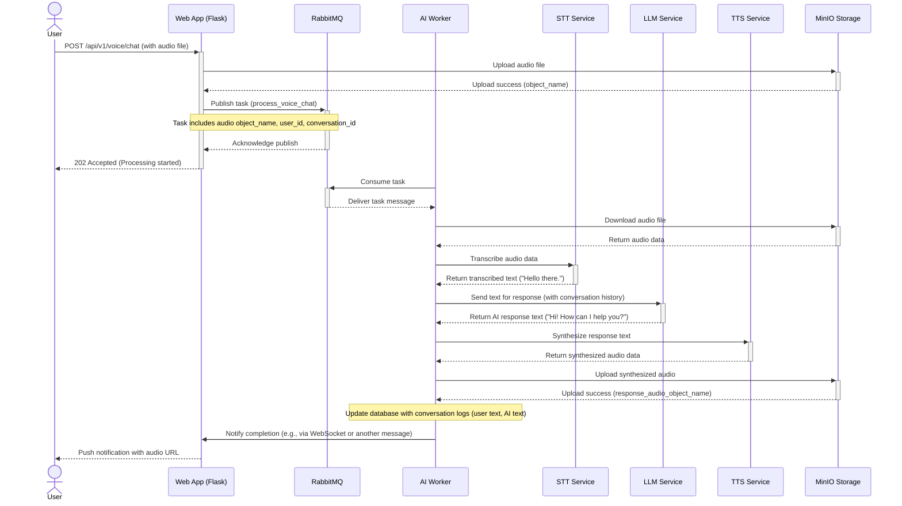
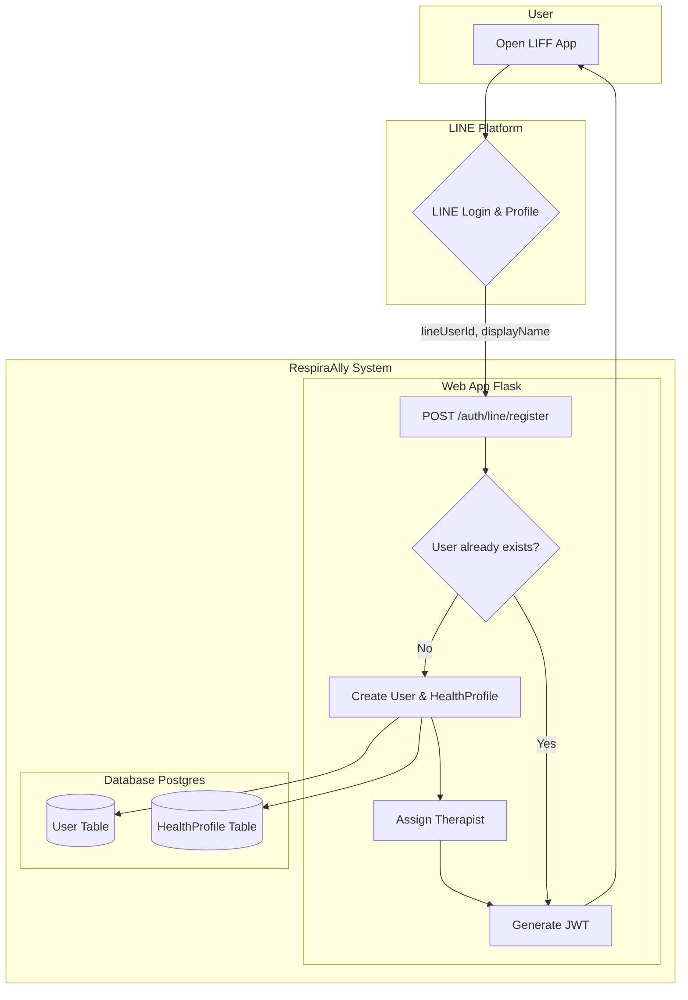

# Core Workflows

This document illustrates key workflows within the RespiraAlly system using sequence diagrams. These diagrams show how different services and components interact to fulfill a user request.

---

## 1. Voice Chat Processing Workflow

This is the primary workflow for handling a user's voice message in the chat interface. It demonstrates the full pipeline from Speech-to-Text (STT), Natural Language Understanding (NLU) via an LLM, and Text-to-Speech (TTS).

### Sequence Diagram

### Workflow Steps

1.  **Audio Submission:** The user records and submits a voice message through the frontend client. The client sends the audio file to the `Web App`'s `/api/v1/voice/chat` endpoint.

2.  **Initial Handling & Storage:** The `Web App` receives the audio file, immediately uploads it to `MinIO` object storage to get a unique `object_name`, and then returns a `202 Accepted` response to the user to indicate the request is being processed asynchronously.

3.  **Task Queuing:** The `Web App` publishes a `process_voice_chat` task to the `RabbitMQ` message queue. The task message contains necessary information like the `object_name` of the audio file, the `user_id`, and a `conversation_id`.

4.  **Task Consumption:** The `AI Worker`, which is subscribed to the queue, consumes the task message.

5.  **Speech-to-Text (STT):** The `AI Worker` retrieves the audio file from `MinIO` and sends it to the `STT Service` (which could be an internal model or a cloud service like Google Speech-to-Text) to get the transcribed text.

6.  **LLM Processing:** The worker sends the transcribed text, along with previous conversation history (retrieved from a database like Redis or Postgres), to the `LLM Service` (e.g., OpenAI GPT-4, Google Gemini).

7.  **Text-to-Speech (TTS):** The `LLM Service` returns a text response. The `AI Worker` then sends this text to the `TTS Service` to generate the response in audio format.

8.  **Finalize and Notify:** The `AI Worker` uploads the synthesized response audio to `MinIO`. It then updates the application database with the new conversation entries (both the user's transcribed text and the AI's response). Finally, it notifies the `Web App` that the process is complete, which in turn sends a notification (e.g., via WebSocket or a push notification) to the user, providing a URL to the response audio.

---

## 2. Patient Registration and Onboarding

This workflow describes how a new patient registers through the LINE Front-end Framework (LIFF) and gets assigned to a therapist.

### Swimlane Diagram

### Workflow Steps

1.  **Initiation:** The user opens the RespiraAlly LIFF application within their LINE app.
2.  **LINE Authentication:** The LIFF app prompts the user to log in with their LINE account, granting the application access to their LINE User ID and profile name.
3.  **Registration Request:** The frontend sends the `lineUserId` and other profile information (first name, last name, etc.) to the `Web App`'s `/api/v1/auth/line/register` endpoint.
4.  **Check for Existing User:** The `Web App` checks the `Database` to see if a user with this `lineUserId` already exists.
5.  **Create New User:** If the user does not exist, a new record is created in the `users` table, and a corresponding record is created in the `health_profiles` table.
6.  **Assign Therapist:** A business logic rule is triggered to automatically assign a therapist (`staff_id`) to the new patient's `HealthProfile`. This could be based on round-robin, patient load, or other criteria.
7.  **Issue Token:** A JSON Web Token (JWT) is generated for the newly created user, establishing a session for them.
8.  **Session Start:** The JWT is sent back to the LIFF application, which can then make authenticated API calls on behalf of the user.
