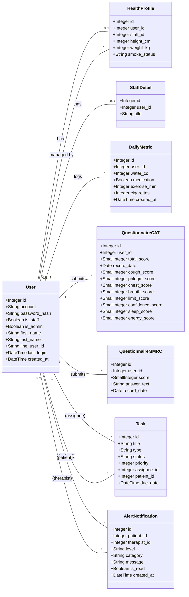

# Database Schema

This document provides an overview of the database schema for the RespiraAlly application, visualized as a class diagram. The schema is defined using SQLAlchemy ORM.

## Schema Diagram

The diagram below illustrates the main data models (tables), their fields, and the relationships between them.

## Model Descriptions

- **User:** The central table for all users, including patients and staff (therapists, admins). It stores login credentials and basic profile information. The `is_staff` and `is_admin` flags determine user roles.

- **HealthProfile:** A one-to-one extension of the `User` model for patients. It stores specific health-related data like height, weight, and smoking status. It also links a patient to their managing therapist (`staff_id`).

- **StaffDetail:** A one-to-one extension for staff members, storing their professional title.

- **DailyMetric:** Stores daily health logs submitted by patients, tracking metrics like water intake, medication adherence, exercise, and smoking.

- **QuestionnaireCAT & QuestionnaireMMRC:** These tables store the results of the standardized COPD Assessment Test (CAT) and Modified Medical Research Council (mMRC) dyspnea scale, respectively. They include the scores and the date the questionnaire was recorded.

- **Task:** Manages tasks assigned to therapists. A task has a type (e.g., education, assessment), a status, a priority, and is linked to an assignee (therapist) and optionally a patient.

- **AlertNotification:** Stores AI-generated alerts for therapists regarding their patients. Each alert has a level (e.g., warning), a category (e.g., adherence), a message, and a read status.

## Relationships

- **One-to-One:** A `User` can have one `HealthProfile` and one `StaffDetail`.
- **One-to-Many:** A `User` can have many `DailyMetric` logs, `QuestionnaireCAT` submissions, `QuestionnaireMMRC` submissions, assigned `Task`s, and `AlertNotification`s.
- **Foreign Keys:** 
    - The `HealthProfile.staff_id` links to a `User` who is a staff member.
    - `Task` has multiple FKs to `User` to represent the `assignee` and `patient`.
    - `AlertNotification` also has two FKs to `User` for the `patient` and `therapist`.
