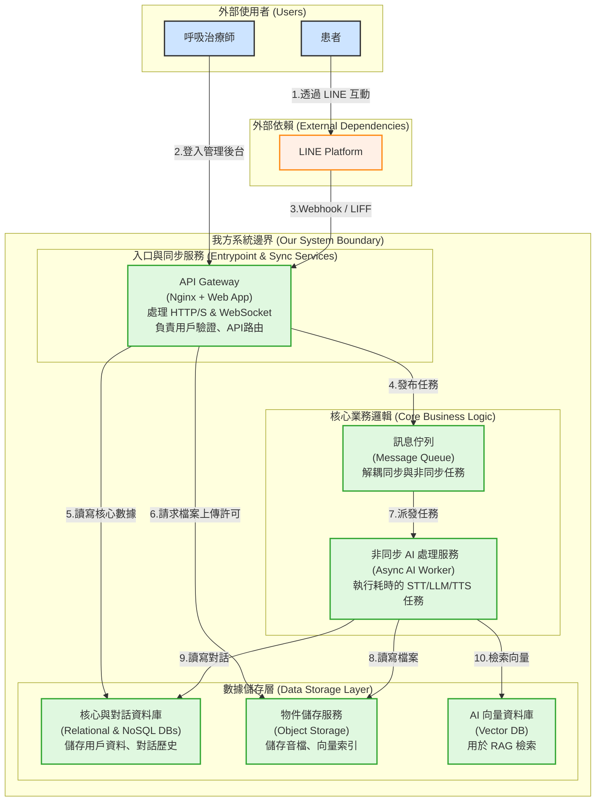
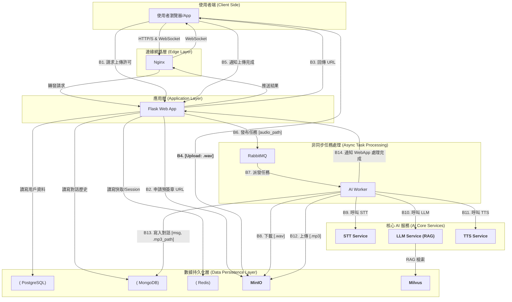

# **系統架構文件 (System Architecture Document)**
- **專案名稱**: 健康陪跑台語語音機器人
- **版本**: 1.1
- **日期**: 2025-07-18
- **作者**: Tech Lead
- **審核者**: 專案負責人

---

## 1. 總覽 (Overview)

本文件旨在定義「健康陪跑台語語音機器人」專案的整體系統架構。此架構的設計目標是實現**高可用性、高擴展性、以及服務間的低耦合**，以支持未來的功能迭代與使用者增長。

本文將首先呈現一個**高層次設計圖**，以提供對系統核心組件及其交互的宏觀理解。隨後，將提供一份詳細的**邏輯架構圖**與**數據流詳解**，深入展示具體的技術實現與數據生命週期。

---

## 2. 高層次系統設計 (High-Level System Design)

本系統從功能職責上，可被抽象為三大核心部分：入口與同步服務、核心業務邏輯、以及數據儲存層。

---

## 3. 詳細邏輯架構 (Detailed Logical Architecture)

以下為系統的詳細邏輯架構圖，展示了具體的技術選型和服務間的詳細數據流。

---

## 4. 數據流詳解 (Data Flow Deep Dive)

以「**一次完整的語音對話**」場景為例，數據在系統中的完整生命週期如下：

1.  **請求上傳 (Request)**: 患者在 LIFF 介面點擊錄音，完成後，前端應用向 Web App 發起請求，申請一個用於上傳音檔的預���章 URL。
2.  **直接上傳 (Upload)**: Web App 向 MinIO 請求一個針對 `audio-uploads` 儲存桶的、有時效性的寫入 URL，並將其返回給前端。前端使用此 URL，透過 HTTP PUT 請求，將 `.wav` 音檔直接上傳到 MinIO。
3.  **任務觸發 (Trigger)**: 上傳成功後，前端通知 Web App。Web App 將一個包含該音檔在 MinIO 中的路徑 (Object Key) 的任務訊息，發布到 RabbitMQ 的任務佇列中。此時，Web App 立刻向前端返回「處理中」的狀態。
4.  **非同步處理 (Process)**: AI Worker 作為消費者，從 RabbitMQ 佇列中取得該任務。
5.  **數據獲取**: AI Worker 根據任務中的路徑，從 MinIO 的 `audio-uploads` 儲存桶中下載原始的 `.wav` 音檔。
6.  **AI 管線 (Pipeline)**: AI Worker 依序調用內部或外部的 AI 服務：
    *   將 `.wav` 音檔發送給 **STT Service** 進行語音轉文字。
    *   將轉換後的文字，連同相關的對話上下文（從 Redis 或 MongoDB 讀取），發送給 **LLM Service**。LLM Service 會查詢 **Milvus** 以獲取相關的 RAG 知識，生成回應文本。
    *   將 LLM 生成的回應文本，發送給 **TTS Service** 生成 `.mp3` 語音檔。
7.  **結果儲存 (Store)**: AI Worker 將新生成的 `.mp3` 語音檔上傳至 MinIO 的 `audio-generated` 儲存桶，並將包含文字回應和 `.mp3` 路徑的完整對話訊息，寫入到 MongoDB 的 `chat_histories` 集合中。
8.  **完成通知 (Notify)**: AI Worker 透過內部機制（如 API 回調或另一個訊息佇列）通知 Web App 任務已完成。
9.  **結果推送 (Push)**: Web App 收到完成通知後，透過 WebSocket 連線，將最終結果（文字訊息和 `.mp3` 播放連結）主動推送給前端介面，完成一次完整的互動。

---

## 5. 技術選型詳述 (Technology Stack)

| 組件分類 | 技術選型 | 選擇理由 |
| :--- | :--- | :--- |
| **反向代理** | Nginx | 成熟、高效能、穩定，社群支援廣泛，適合處理負載均衡與 WebSocket 代理。 |
| **Web 應用框架** | Flask (Python) | 輕量、靈活，適合做為 API Gateway 和處理同步請求。 |
| **非同步任務佇列**| RabbitMQ | 成熟、可靠的訊息代理，支援多種訊息模式，能有效解耦 Web App 與 AI Worker。 |
| **核心資料庫** | PostgreSQL | 功能強大的開源關聯式資料庫，以其穩定性和資料一致性著稱。 |
| **對話歷史資料庫**| MongoDB | 靈活的 NoSQL 文件資料庫，適合儲存半結構化的對話歷史，易於查詢與擴展。 |
| **快取/Session** | Redis | 高效能的記憶體內資料庫，適合用於快取熱點數據和管理使用者 Session。 |
| **物件儲存** | MinIO | 高效能的 S3 相容物件儲存服務，適合統一管理音檔、備份、與向量索引等非結構化數據。 |
| **向量資料庫** | Milvus | 專為大規模向量相似性搜尋設計的開源資料庫，是建構高效能 RAG 應用的理想選擇。 |
| **AI 服務** | 獨立容器化服務 | 將 STT/LLM/TTS 容器化，實現了與主應用的解耦，便於獨立擴展、更新與維護。 |

---

## 6. 安全性考量 (Security Considerations)

- **上傳安全 (Upload Security)**:
    - **預簽章 URL (Pre-signed URLs)** 是我們上傳機制的安全核心。它確保了客戶端只能在指定時間內、向指定的儲存桶和路徑上傳檔案，有效防止了未經授權的寫入操作。

- **網路安全 (Network Security)**:
    - **傳輸加密 (Encryption in Transit)**: 所有對外的通訊（使用者到 Nginx）以及內部服務間的重要通訊，都必須強制使用 TLS/SSL 加密。
    - **內部網路**: 核心後端服務（Web App, Worker, Databases）應部署在私有網路 (VPC) 中，僅透過 Nginx 或內部負載均衡器暴露必要的服務端口。

- **數據安全 (Data Security)**:
    - **靜態加密 (Encryption at Rest)**: 所有持久化儲存（PostgreSQL, MongoDB, MinIO）中的數據，都必須啟用靜態加密功能。
    - **憑證管理 (Credentials Management)**: 所有服務的密碼、API Key 等憑證，都必須透過安全的秘密管理工具（如 HashiCorp Vault 或雲端廠商提供的 Secrets Manager）進行管理，嚴禁硬編碼在程式碼或配置文件中。

- **身份驗證 (Authentication)**:
    - **服務間驗證**: 內部服務之間的 API 調用，應考慮使用 API Key、OAuth 2.0 客戶端憑證模式或 mTLS 等機制進行身份驗證，確保請求來源的合法性。

---
