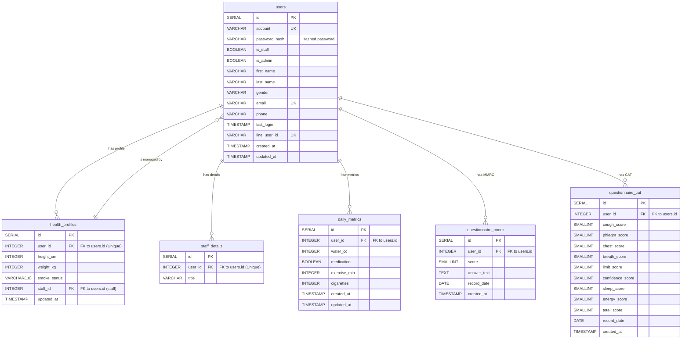

# **系統設計文件 (SDD): 資料庫與儲存設計**
- **專案名稱**: 健康陪跑台語語音機器人
- **版本**: 2.0
- **日期**: 2025-07-18
- **作者**: 後端團隊
- **關聯架構**: `02_system_architecture_document.md`
- **關聯需求**: `00_project_brief_prd.md`

---

## 1. 總覽 (Overview)

本文件詳細定義了專案所使用的各個數據儲存系統的內部結構設計。此設計基於 V2.0 的產品需求，特別加入了對臨床問卷 (MMRC & CAT) 的支持。本文件是後續所有後端開發的數據模型基礎。

本文件涵蓋以下三個核心儲存系統的設計：
1.  **PostgreSQL**: 核心關聯式數據。
2.  **MongoDB**: 半結構化對話歷史數據。
3.  **MinIO**: 非結構化物件儲存。

---

## 2. PostgreSQL: 核心數據模型 (ER 圖)

本資料庫負責儲存需要強一致性和關聯性的核心業務數據，包含使用者、健康檔案及臨床問卷結果。



### **資料表詳解**:

- **`users`**: 系統的統一使用者表，透過 `is_staff` 區分病患與呼吸治療師。`account`, `email`, 和 `line_user_id` 應為唯一鍵。`password_hash` 儲存加密後的密碼。
- **`health_profiles`**: 儲存病患的靜態健康檔案。`user_id` 是唯一鍵，確保一個使用者只有一份健康檔案。`staff_id` 直接關聯到 `users` 表中 `is_staff` 為 true 的使用者。
- **`staff_details`**: 儲存呼吸治療師的額外資訊，如職稱。`user_id` 是唯一鍵。
- **`daily_metrics`**: 記錄病患每日回報的健康日誌。
- **`questionnaire_mmrc`**: 記錄 MMRC 呼吸困難問卷的結果。
- **`questionnaire_cat`**: 記錄 CAT 問卷的各項分數與總分。

---

## 3. MongoDB: 對話歷史文件結構

本資料庫負責儲存半結構化的對話歷史數據。我們採用兩個 Collections 的設計來對應邏輯上的對話會話與訊息。

### **Collection: `conversations`**
儲存每一次完整的對話會話元數據。

**文件結構 (Document Structure):**
```json
{
  "_id": "ObjectId('...')",
  "patient_id": 123, // 對應 PostgreSQL users.id
  "therapist_id": 456, // 對應 PostgreSQL users.id, 可為 null
  "start_time": "ISODate('2025-07-26T10:00:00Z')",
  "end_time": "ISODate('2025-07-26T10:15:00Z')", // 可在會話結束時更新
  "summary": "病患今日表示有輕微的呼吸困難情況。", // 可選，由 LLM 生成的摘要
  "created_at": "ISODate('...')"
}
```
**索引建議 (Index Suggestions):**
- `patient_id`
- `therapist_id`
- `start_time`

### **Collection: `chat_messages`**
儲存單一的對話訊息，並透過 `conversation_id` 關聯到一個 `conversations` 文件。

**文件結構 (Document Structure):**
```json
{
  "_id": "ObjectId('...')",
  "conversation_id": "ObjectId('...')", // 對應 conversations._id
  "sender_type": "user", // "user" 或 "ai"
  "content": "我今天覺得有點喘，應該怎麼辦？",
  "audio_url": "minio/audio-generated/path-to-file.mp3", // 可選
  "timestamp": "ISODate('2025-07-26T10:00:15Z')"
}
```
**索引建議 (Index Suggestions):**
- `conversation_id`
- `timestamp`

---

## 4. MinIO: 物件儲存桶規劃

(此部分設計維持不變)

- **Bucket 1: `audio-uploads`**: 儲存患者上傳的原始音檔。
- **Bucket 2: `audio-generated`**: 儲存 AI 生成的回應語音檔。
- **Bucket 3: `rag-knowledge-base`**: 儲存 RAG 的原始文件。

---
