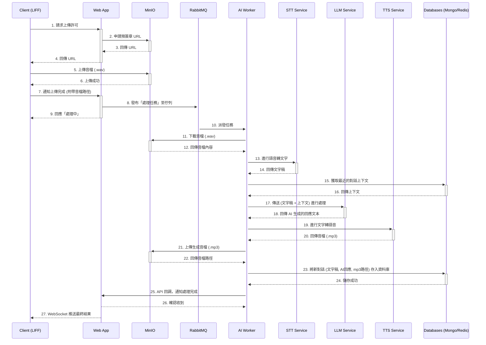
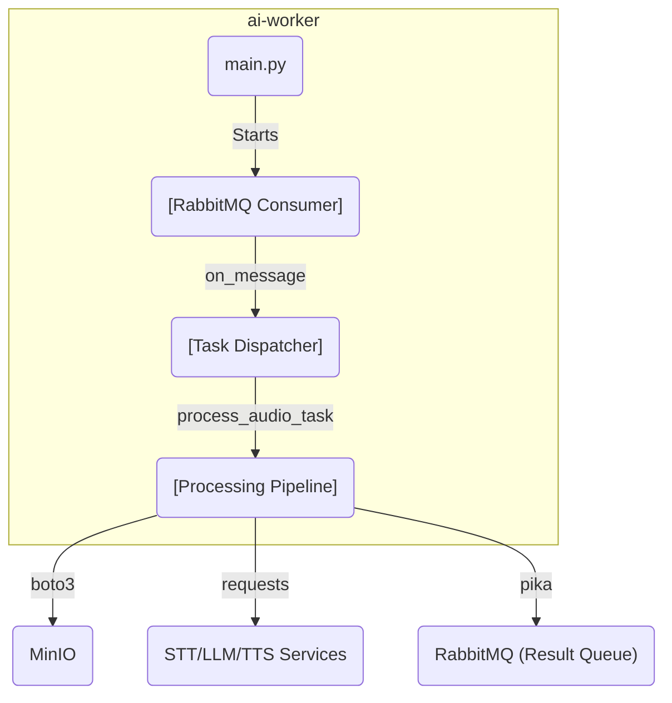

# **系統設計文件 (SDD): 核心業務邏輯**
- **專案名稱**: 健康陪跑台語語音機器人
- **版本**: 1.0
- **日期**: 2025-07-18
- **作者**: 後端團隊
- **關聯架構**: `02_system_architecture_document.md`

---

## 1. 總覽 (Overview)

本文件旨在詳細闡述專案中核心且複雜的業務邏輯流程。它透過高階的時序圖和深入的微服務設計詳解，清晰地展示了系統的運作方式。

本文件將主要聚焦於最核心的業務——「**AI 語音處理**」的完整流程。

---

## 2. 核心業務流程時序圖：AI 語音處理

以下時序圖詳細描繪了從使用者上傳音檔，到最終接收到 AI 語音回應的完整端到端 (End-to-End) 流程。

### **3. 流程階段說明**

#### **階段一：安全上傳與任務觸發 (步驟 1-9)**
- **目標**: 安全地將使用者音檔上傳至物件儲存，並觸發一個非同步的處理任務。
- **核心機制**:
    - **預簽章 URL**: Web App 作為協調者，向 MinIO 申請一個有時效性、有特定目標的一次性上傳 URL。這是確保上傳安全的關鍵。
    - **非同步觸發**: Web App 在確認客戶端已上傳成功後，僅將一個輕量的任務訊息（包含音檔路徑）發布到 RabbitMQ。
- **使用者體驗**: 此階段的設計確保了客戶端可以快速得到「處理中」的響應，無需等待後續耗時的 AI 處理。

#### **階段二：AI Worker 非同步處理 (步驟 10-24)**
- **目標**: 在後台獨立地完成所有耗時的 AI 處理與數據儲存。
- **核心機制**:
    - **任務消費**: AI Worker 作為 RabbitMQ 的消費者，監聽並獲取待處理的任務。
    - **AI 處理管線 (Pipeline)**: Worker 嚴格按照 `STT -> LLM -> TTS` 的順序調用 AI 服務。
    - **數據持久化**: Worker 負責將處理過程中的所有重要數據（如：生成的音檔、對話記錄）持久化到對應的儲存系統（MinIO, MongoDB）中。
- **系統效益**: 此階段的非同步特性，將主 Web App 從繁重的計算任務中解放出來，極大地提升了系統的整體吞吐量和穩定性。

#### **階段三：結果推送 (步驟 25-27)**
- **目標**: 將處理完成的最終結果，主動推送給在線的使用者。
- **核心機制**:
    - **API 回調**: AI Worker 在完成所有工作後，透過一次 API 呼叫，通知 Web App 任務已完成。
    - **WebSocket 推送**: Web App 在接收到完成通知後，利用已建立的 WebSocket 長連線，將結果即時地推送給對應的使用者客戶端。
- **使用者體驗**: 使用者無需反覆刷新，即可在其 LIFF 介面中看到 AI 的最終回應，實現了近乎即時的互動感。

---

### **4. 微服務內部設計詳解**

本章節將深入探討參與核心業務流程的各個微服務的內部架構與當前實現狀態。

#### **4.1 AI Worker (`ai-worker`)**

AI Worker 是整個非同步處理流程的協調者。

-   **技術棧**: Python, `pika` (RabbitMQ 客戶端), `requests` (HTTP 客戶端), `boto3` (MinIO 客戶端)。
-   **核心邏輯**:
    1.  **啟動**: 程式啟動後，進入一個無限循環，持續監聽 RabbitMQ 的 `task_queue`。
    2.  **任務消費**: 使用 `pika` 的 `basic_consume` 方法註冊一個回呼函式 (`callback`)，非同步地接收任務。
    3.  **任務分派**: 在回呼函式中，解析收到的 JSON 訊息。根據訊息中是否存在 `text` 或 `bucket_name` 鍵，將任務分派給不同的處理函式。
    4.  **處理管線 (`process_audio_task`)**:
        -   使用 `boto3` 從 MinIO 下載音檔。
        -   使用 `requests` 依序呼叫 STT, LLM, TTS 服務的 HTTP API。
        -   處理完成後，將包含最終結果的通知訊息發布到 RabbitMQ 的 `notifications_queue`。
-   **組件圖**:

#### **4.2 AI 服務通用架構 (LLM, STT, TTS)**

所有 AI 服務均採用了統一的輕量級架構。

-   **技術棧**: Python, FastAPI。
-   **通用模式**:
    -   **Web 框架**: 使用 FastAPI 提供非同步 HTTP API 端點。
    -   **入口點**: `main.py` 負責創建 FastAPI 應用實例並掛載 API 路由器。
    -   **API 層**: `app/api/` 目錄下存放路由定義，負責處理請求驗證和回應格式化。
    -   **服務層**: `llm-service` 和 `stt-service` 包含 `app/core/` 目錄，用於封裝核心業務邏輯，並透過 FastAPI 的依賴注入系統提供給 API 層使用。

#### **4.3 AI 服務實現狀態 (重要)**

-   **LLM Service (`llm-service`)**:
    -   **端點**: `POST /api/v1/chat`
    -   **狀態**: **佔位符實現**。不執行任何真實的 LLM 推理。僅返回一個 `Echo: <輸入文字>` 格式的字串。

-   **STT Service (`stt-service`)**:
    -   **端點**: `POST /api/v1/transcribe`
    -   **狀態**: **佔位符實現**。不執行任何真實的語音辨識。僅返回一個 `transcribed_<檔名>` 格式的假轉錄字串。

-   **TTS Service (`tts-service`)**:
    -   **端點**: `POST /api/v1/synthesize`
    -   **狀態**: **佔位符實現**。不執行任何真實的語音合成。僅返回一個固定的成功訊息 `{"message": "Synthesize endpoint is working"}`。

---
