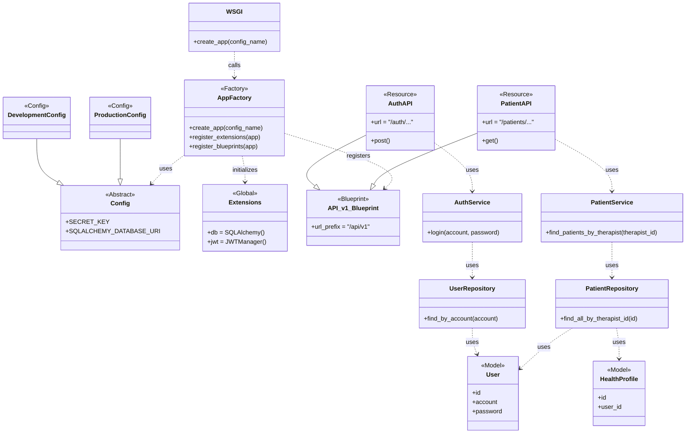

# **系統設計文件 (SDD): 後端主應用程式結構**
- **專案名稱**: 健康陪跑台語語音機器人
- **版本**: 1.0
- **日期**: 2025-07-18
- **作者**: 後端團隊
- **關聯架構**: `02_system_architecture_document.md`

---

## 1. 總覽 (Overview)

本文件詳細定義了後端主應用 (Flask Web App) 的內部程式結構。此設計旨在建立一個可測試、可擴展、且易於維護的應用程式，並與專案既有的 `wsgi.py` 檔案所採用的**應用程式工廠模式 (Application Factory Pattern)** 完全整合。

---

## 2. 核心設計模式

本應用程式採用以下核心設計模式：
- **應用程式工廠模式**: 應用程式的實例 (app) 是在一個工廠函式 `create_app()` 中動態建立和配置的。這允許我們根據不同的環境（開發、測試、生產）載入不同的設定，並有效避免循環引用的問題。
- **藍圖 (Blueprints)**: 我們將 API 按照業務模組（如認證、病患管理）劃分為不同的藍圖。每個藍圖都是一組相關路由的集合，由工廠函式統一註冊，這使得 API 的組織和版本管理非常清晰。
- **分層架構 (Layered Architecture)**: 程式碼在邏輯上被劃分為不同層次，以實現關注點分離：
    1.  **API 層 (Controllers/Resources)**: 負責處理 HTTP 請求與回應，位於 `app/api`。
    2.  **核心層 (Core Layer)**: 負責處理核心的業務邏輯 (Services) 與數據存取 (Repositories)，位於 `app/core`。
    3.  **模型層 (Model Layer)**: 定義數據庫結構，位於 `app/models`。

---

## 3. 程式結構類別圖 (Class Diagram)

以下類別圖展示了專案的物理資料夾結構 (`app/api`, `app/core` 等) 與邏輯分層之間的對應關係。

### **4. 模組職責詳解**

- **`wsgi.py`**: 專案的唯一啟動點。其職責是從環境變數中讀取設定名稱，並呼叫 `app` 模組中的 `create_app` 工廠函式。

- **`app/`**: 核心應用程式套件。
    - **`app/app.py`**: 包含 `create_app()` 工廠函式，負責組裝整個應用。
    - **`app/config.py`**: 定義不同環境（開發、生產、測試）的設定類別。
    - **`app/extensions.py`**: 統一宣告所有 Flask 擴充套件的實例（如 `db`, `jwt`），以供工廠函式進行初始化。
    - **`app/api/`**: 存放所有 API 藍圖。每個子模組（如 `auth.py`, `patient.py`）都定義了一個 Blueprint，並包含其下的所有 API Resources。
    - **`app/core/`**: 存放核心業務邏輯 (Services) 與數據存取 (Repositories) 的模組。此目錄合併了傳統分層架構中的服務層與數據存取層，旨在簡化模組結構。
    - **`app/models/`**: 存放所有 SQLAlchemy 的資料庫模型類別。

---
